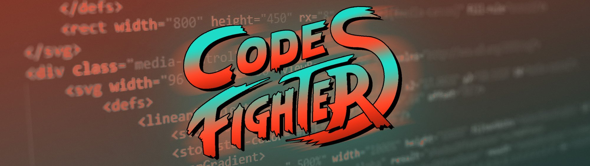

# Code Fighters - Proyecto Módulo 1

¡Hola! Este es nuestro proyecto final para el módulo 1 del **bootcamp de programación front-end** de [Adalab](https://adalab.es/) en el que hemos puesto en práctica los conocimientos adquiridos durante el primer módulo.  Partiendo de un diseño dado en Zeplin y siguiendo la filosofía Agile hemos trabajado en equipo, construyendo una web en la que podréis conocernos mejor. En ella tenéis disponible información sobre nosotras y medios de contacto, a través de nuestras RRSS y de un formulario. 

### ¿Dónde verlo?

[Code-Fighters](http://beta.adalab.es/project-promo-o-modulo-1-team-9/)


### Integrantes del equipo

[](https://github.com/NoeliaPH)
[](https://github.com/NataliaaJN)
[](https://github.com/PaulaEPR) 
[](https://github.com/PaulaEPR)

### Tecnologías utilizadas

- HTML
- Preprocesador de CSS: SASS con sintaxis SCSS
   - BEM
   - Flexbox y Grid
   - Variables
   - Estilos anidados
- Control de versiones con Git a través de la terminal
- Automatización de procesos con Gulp de NodeJS
- Planificación del proyecto bajo el marco de trabajo Scrum
   - Slack
   - GitHub Projects

Si tenéis cualquier duda no dudéis en contactarnos, y por último pero no menos importante...

```bash
¡no olvideis hacer git pull!
```
